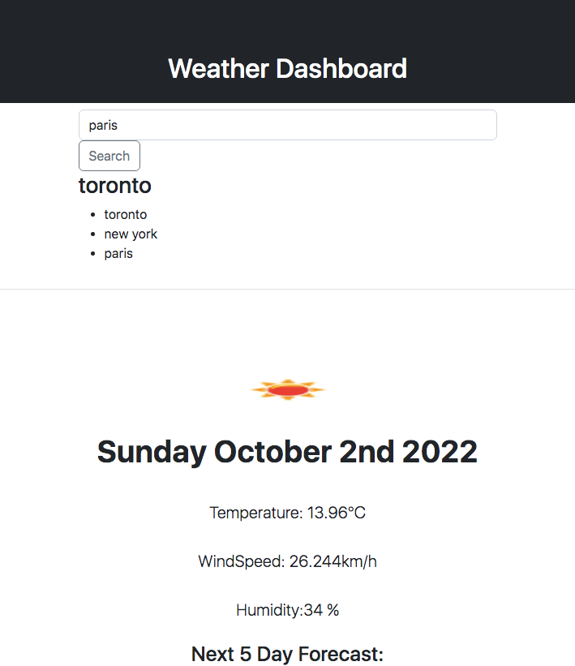

# module6serversideapisweatherdashboard
## Weather Dashboard - Server Side APIs

## The Task

#### To build a weather dashboard that will run in the browser and feature dynamically updated HTML and CSS.The weather dashboard will display the weather for the current day as well as the next 5 days. Also using the [OpenWeather One Call API](https://openweathermap.org/api/one-call-api) to retrieve weather data for cities and using `localStorage` to store any persistent data. 

## Mockup

The following image demonstrates the application functionality:

#### Application deployed live URL:
https://thivsiv28.github.io/module6serversideapisweatherdashboard/

#### Application GitHub Repository URL:
https://github.com/thivsiv28/module6serversideapisweatherdashboard

